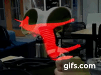

# Magic Leap

### Sia Peng and Angi Li

## What we built

We both have some experience with Oculus & VR but haven't tried AR lenses yet. Hence, for our heack-a-thing 2, we want to explore AR in Magic Leap.

We downloaded package tool for Magic Leap, set up previewing with Unity Play Mode, added Device streaming, and created a Unity Project with corresponding SDK and project settings. We then created a simple scene with a unicorn in it.

Moving on, we also implemented a script that mobilizes the unicorn per user input (Hand Poses/Gestures). Specifically, the unicorn is static initially but it will then be activated once our app recognizes the "OK" hand pose. Once active, the user can control which direction the unicorn rotates via left or right hand OpenHand, "fist" and "finger" hand poses. The "fist" hand pose rotates the unicorn around the vertical axis, and the "finger" pose rotates it around the horizontal axis. Switching from left and right hands changes the direction the unicorn rotates.

## Who did What

### Sia
I set up the initial Unity project with customized settings for play in Magic Leap. I also set up the Device and connected it to our project with Previewing with Unity Play Mode. I also added Device Streaming. I also made a unicorn model to be played with.

### Angi
I also set up the development environment for Magic Leap in Unity, created a simple cube to be initially tested, then implemented a script that uses the Gestures API in the Lumin SDK to recognize hand poses and manipulate the rotation of the unicorn based on which hand pose is recognized.

## What we learned
We went through the steps of setting up a project to be compatible with Magic Leap, installed the necessary tools and software, and configured settings both in Unity and on the device. We also set up device live-streaming with Device Stream.

Settings aside, we learned a little about how gesture tracking and hand tracking works using the Lumin SDK's built in API that uses machine learning to detect hand poses. We created a model of a unicorn, and learned how to control it using a few of the hand poses. Overall, working with the Magic Leap was a very cool experience, well-documented, and something we hope to continue working with in our actual project.

## How does this hack-a-thing inspire you or relate to your possible project ideas?
This project inspired us to do more creative AR related project. Previously, because of equipment limitations, we only thought of VR project in Oculus or AR project on smartphones. However, seeing how powerful Magic Leap is, especially the possibility of it being controller-free, motivated us to do more adventurous projects, such as an annotation app that incorporates with real world objects and a game that users can interact with only hand gestures. 

## What didn't work
Setting up the Magic Leap took a lot longer than expected, just in terms of adjusting settings and getting the required certificates. Then, at first getting the Magic Leap device streaming to the computer was a bit buggy. We soon got it working using the Device Stream package which is currently in beta. The Device Stream works fairly well, but the feed is very laggy, which caused issues when we tried to record sample videos. Overall, the Device Stream feature is a really useful one to have, even if a bit laggy.

We also initially had a bit of trouble getting the cube to show in the field of vision, but soon learned to adjust objects in the scene to fit the ML view.

## Reference
- [Dev Set up] (https://creator.magicleap.com/learn/guides/develop-setup)
- [Device Set up] (https://creator.magicleap.com/learn/guides/develop-device-setup)
- [Connect] (https://creator.magicleap.com/learn/guides/connect-device)
- [Certificate] (https://creator.magicleap.com/learn/guides/developer-certificates)
- [Starter] (https://creator.magicleap.com/learn/guides/get-started-developing-in-unity)
- [Unity Setup] (https://creator.magicleap.com/learn/guides/unity-setup)
- [First App] (https://creator.magicleap.com/learn/guides/gsg-create-your-first-unity-app)
- [Play Mode] (https://creator.magicleap.com/learn/guides/sdk-play-mode-in-unity-with-ml-remote)
- [Hand Post] (https://creator.magicleap.com/learn/guides/gestures-in-unity)

## Versions

### Unity

2019.2.x

### MLSDK

v0.22.0

### LuminOS

0.97.x
